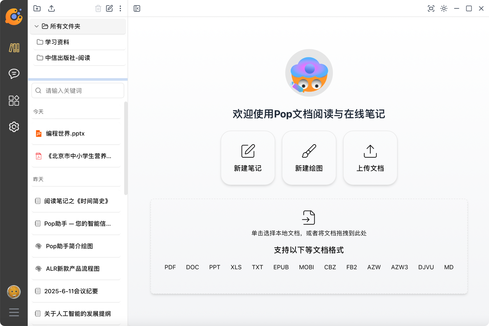
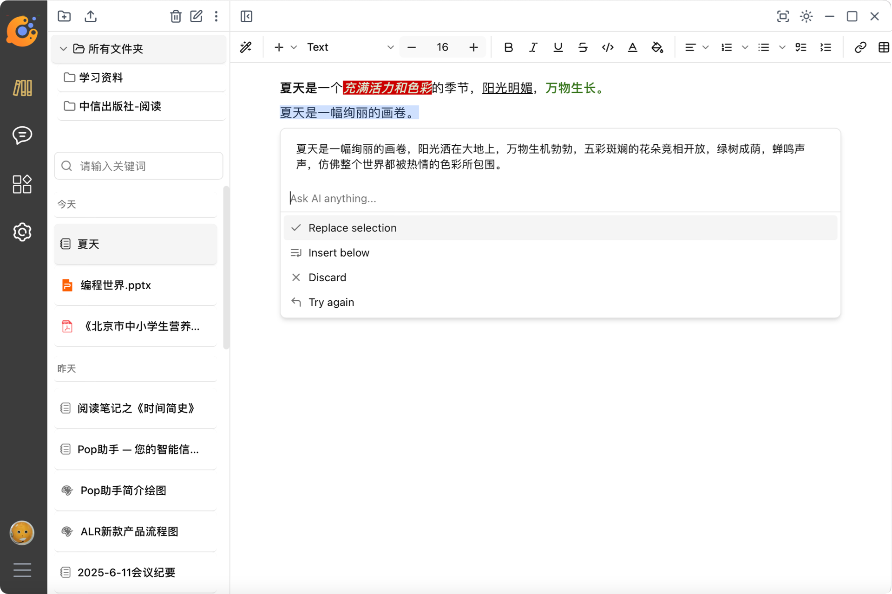
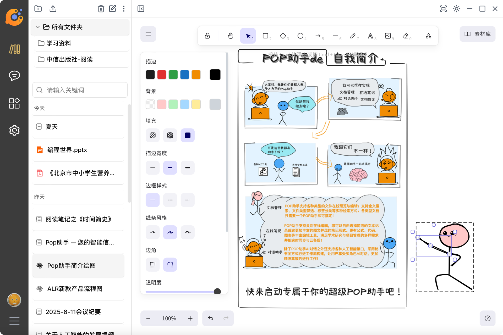
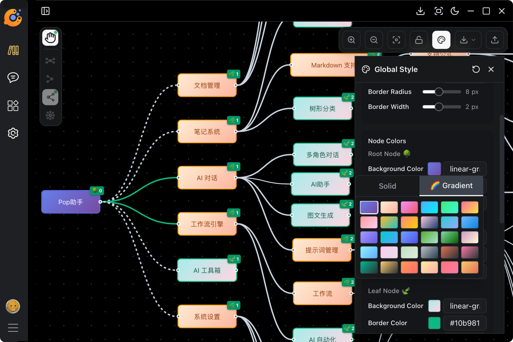
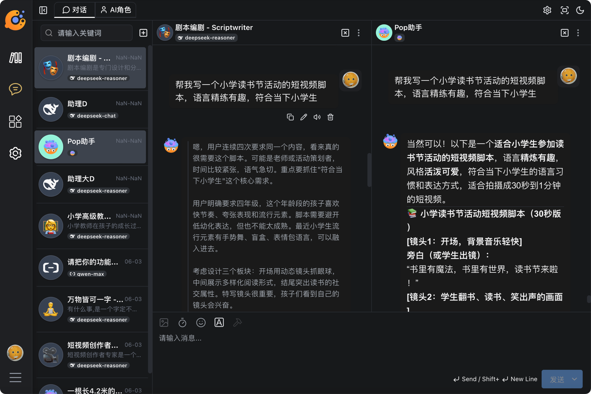

  <a href="README-cn.md">简体中文</a> |
  <a href="README-tw.md">繁體中文</a> |
  <a href="README.md">English</a>

# Pop Assistant

> All-in-one intelligent creation & information management platform

A unified platform for intelligent knowledge and productivity, redefining your information workflow.

**Pop Assistant** integrates online notes, document reading & management, smart drawing, mind mapping, personalized knowledge base, and AI collaboration. It provides a complete loop for individuals and teams, from content collection and creation to intelligent retrieval and decision support.

Whether you are a developer, researcher, marketer, legal consultant, or a multi-role freelancer, **Pop** will significantly boost your information management efficiency and creativity, letting inspiration and value burst forth together.

---

## 📂 Document Management Center

- **Multi-format Support**: Upload and preview PDF, DOCX, TXT, Markdown, EPUB, MOBI, CBZ, DJVU, FB2, AZW3, and other mainstream formats online.
- **Smart Classification & Search**: Manage folders, tag system, full-text search, file type filtering, and quickly locate the content you need.
- **Fast Retrieval**: Accurate content targeting based on full-text search and tag system.
  

    
     
    <em>Pop Assistant · Document Management</em>
  

---

## 💡 Knowledge Q&A

- **Personalized Knowledge Base**: Build your own knowledge base as needed, centrally manage important materials, and support multi-format import and unified integration.
- **Intelligent Q&A Engine**: Based on AI semantic understanding and knowledge reasoning, quickly and accurately answer professional or daily questions.

---

## 📝 Online Notes

- **Flexible Editing**: Supports Markdown and rich text, with formulas, code, highlighted charts, and more.
- **Offline First**: Local SQLite + incremental CRDT log architecture, edit offline, sync in seconds when online.
- **Multi-dimensional Linking**: Notes can reference document paragraphs, drawing nodes, or AI-generated blocks to build a knowledge network.
- **Real-time Sync & Cloud Backup**: Automatic multi-device sync to ensure content consistency and access anytime.
  

    
     
    <em>Pop Assistant · Notes Editing</em>
  

---

## 🧠 Online Drawing

- **WYSIWYG**: Drag and drop to build flowcharts, topology, system architecture, and hand-drawn sketches, with auto layout and coloring.
- **AI Sketch Generation**: Enter prompts like "draw a three-layer microservice architecture" to generate diagrams.
- **Bidirectional Linking**: Graphic blocks can link to note paragraphs or documents, with auto highlight sync.
- **Multi-format Export**: Export as SVG/PNG in high definition, PDF for lossless copy-paste into PPT or Keynote.

    

  
   
  <em>Pop Assistant · Online Drawing</em>
  

## 🗺️ Mind Mapping

Structure knowledge as a graph to aid thinking and collaboration.

- **Structured Expression**: Freely drag nodes, branches, and topics to quickly build a clear knowledge tree.
- **AI Smart Expansion**: Enter a topic or question, and AI will automatically generate branch suggestions to assist brainstorming and knowledge sorting.
- **Diverse Styles**: Rich theme colors, node icons, and layout options to meet different scenarios.
- **Content Linking**: Nodes can be linked to notes, documents, tasks, or AI-generated content to build a multi-dimensional knowledge network.
- **Easy Export**: One-click export as SVG, PNG, etc., for easy embedding in reports or presentations.

  

  
   
  <em>Pop Assistant · Mind Map Feature</em>
  

---

## 🤖 AI Assistant

- **Intelligent Creation**: Write reports, articles, copywriting, etc., with AI generating content based on context.
- **Multi-role Collaboration**: Switch between multiple AI roles for endless inspiration.
- **Sentiment Analysis & Optimization**: Automatically detect text sentiment and provide tone suggestions to improve communication.
- **Personalized Suggestions**: Optimize dialogue experience based on user preferences and history.
  

    
     
    <em>Pop Assistant · AI Chat</em>
  

---

## 🔐 Privacy Protection

- **Data Encryption & Secure Storage**: End-to-end encrypted transmission and local encrypted storage, compliant with international privacy standards.
- **Custom Privacy Settings**: Freely set permissions and data control options to manage your personal information security.

---

## 🌍 Multilingual Support

- **Global Experience**: Supports multilingual UI and AI responses for seamless cross-language interaction.
- **Smart Translation & Localization**: Built-in translation engine for real-time translation and local semantic optimization.

---

## ⚙️ Personalization

- Customize avatar, nickname, theme (light/dark), language, timezone, font size, and shortcuts.
- Enable AI autocomplete for notes, adjust dialogue parameters such as temperature, Top-p, and formatting.
- One-click binding of multiple models (e.g., OpenAI, DeepSeek), flexible toolchain and workflow control.
- All settings take effect instantly and sync across devices to fit your workflow.
- Every setting is designed to enhance your focus and creative efficiency.

---

> **Pop Assistant** — Make your information more organized and your creation more efficient!
